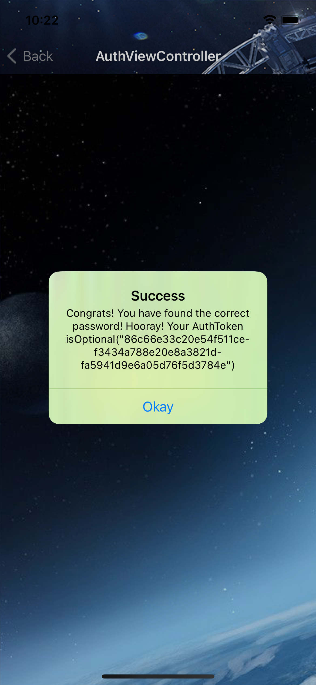

# Yaar Prime with hash-based Proof-Of-Work iOS App.

You are part of an elite group of futuristic hackers that believe in freedom of knowledge and information. You use your powers for the greater good and for the opposition against tyranny, monarchies and anti-democratic societies. It is the year 2372 and humanity has finally became a type 2 civilization on the Kardashev scale and is able to use all the available energy of it’s solar system. Unfortunately, An extraterrestrial species of aliens on the other side of the Milky Way has slowly became greedy, turned to the dark side, became a militarized dictatorship and convinced themselves that they are the true rulers of the universe and no one else. They see your peaceful and prosperous civilization as a threat to their mission to conquer the entire galaxy. They ignored any types of diplomatic resolutions and outright broke various intergalactic treaties.

They want to destroy the solar system by using a super massive black hole with gravity so immerse that it completely “destroys” anything that comes inside it’s event horizon.

Luckily all the computer engineers fled and they are left with ancient technology from the 2020s contained in this exact docker image!

Your mission is simple. Design a iOS app to assist people to brute force the application to get an auth token and change the data inside the application to redirect the black hole to have both X & Y coordinates of 0.

Good Luck!

## Refer finalResult.docx for Final Hash

## Installation
pod install
open Yaar.xcworkspace. 
Select the iphone simulator & run it.

## Requirements

- iOS 14.0
- Xcode 12
- Swift 5

## Features
### MainViewController

- A side panel button to open up the DataStoreViewController at the top navigation. Should be aligned to the left.
- Should include the above space station image as a top header to welcome the user
- A textbox to input the specific URI to connect to
- A button to Start fetching/brute forcing to get the auth token. It should redirect to the AuthViewController with an animation
- A button to fetch and render the current difficulty
- A button to fetch and render the current attempts & total attempts

### AuthViewController
A back button to go back to the MainViewController at the top navigation. Should be aligned to the left.
As a background process, a real-time stream must be sent for every request to a private room with a bot called authbot inside a running Matrix homserver inside a docker container

### DataStoreViewController

- Must be a side panel bar which pushes the MainViewController and covers 60% of the screen. Should pop out from the left side of the screen
- A textbox to input the auth token to be used to query the datastore
- A button to get the datastore and convert it to a readable format to render in a textbox
- A button and textbox input to update & query the datastore
- A button to call the verify endpoint of the datastore and show the hash given if successful
- If the user clicks outside of the view, the side panel closes from the right to the left

- XCTestCase for JSON Decoding and unit testing.
- XCTestCase for UITesting.

## Design Pattern: Model-View-ViewModel (MVVM)
is a structural design pattern that separates objects into three distinct groups:
- #### Models 
  - hold application data. They’re usually structs or simple classes.
- #### Views 
  - display visual elements and controls on the screen. They’re typically subclasses of UIView.
- #### View models
  - transform model information into values that can be displayed on a view. They’re usually classes, so they can be passed around as references.
  
  
  ## Improvements/ Need to be done
- Due to time constraints, Didn't get a chance to complete AuthViewController matrix integration.
- There are some issues in matrix image i can't able to register new user, even on the web client.
- As a background process, a real-time stream must be sent for every request to a private room with a bot called authbot inside a running Matrix homserver inside a docker container
- A table which shows in real-time the latest requests. The data must be pulled from a Matrix homeserver running locally inside a docker container. You can implement pagination to show a subset of data at a time so the view is not overloaded. The table should be similar to the format below but rendered properly in iOS
-  A button to clear all the logged requests from view. It shouldn't delete the data from Matrix
- A Textbox search to search and filter by a specific hash or prime number
- Some Minor UI fixes.
- Side panel UI improvement using sidemenu pod.

## Technology/Tools
- UIKit
- Views are defined by using StoryBoard and XIBs
- CryptoSwift for SHA512
- SideMenu for side panel
- MatrixSDK for matrix
- MVVM
- XCTestCase for unit tests and UI Tests.
- Xcode Instruments for memory leaks and allocations.

## Demo

